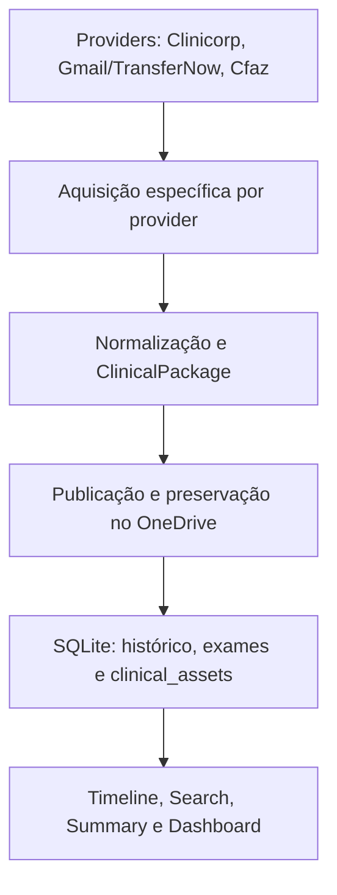

# IREO Clinical Intelligence

## Avaliação crítica do histórico e documento de transição

**Data da avaliação:** 26 de julho de 2026
**Fonte principal:** `historico chat ireo clinical intelligence 1.pages`
**Finalidade:** avaliar criticamente a trajetória do desenvolvimento e fornecer contexto confiável para outra sessão de ChatGPT/Codex.

---

## Diretriz vigente desde 27 de julho de 2026

Antes de propor arquitetura ou nova implementação, toda sessão deve aplicar o
[princípio canônico de MVP de alto valor clínico](../ENGINEERING_MASTER.md#15-princípio-obrigatório-de-mvp-de-alto-valor-clínico).
MVP significa a menor entrega vertical utilizável com benefício real e
mensurável no IREO; não autoriza reduzir segurança, integridade, LGPD,
associação inequívoca de pacientes ou revisão humana.

A ordem vigente é:

1. concluir a aquisição automatizada de exames de imagem;
2. validar seu benefício operacional e clínico no IREO;
3. iniciar o Patient Recall Engine;
4. ampliar robustez apenas por risco concreto, necessidade atual ou valor
   demonstrado.

As recomendações históricas posteriores neste documento devem ser lidas à luz
dessa decisão. Nenhum novo chat deve elevar automaticamente o sistema ao padrão
de produto comercial. Toda nova tarefa deve responder ao gate pragmático do
documento mestre e declarar o que será explicitamente adiado.

---

## 1. Parecer executivo

O desenvolvimento do IREO Clinical Intelligence foi **tecnicamente assertivo na construção da infraestrutura de aquisição, normalização, publicação e consulta de dados**, especialmente considerando que o projeto foi iniciado por um cirurgião-dentista sem formação prévia em programação. A contribuição mais importante do usuário foi fornecer conhecimento do fluxo clínico real, identificar tarefas repetitivas e insistir em validações com casos reais.

O projeto também tomou decisões corretas de engenharia:

- abandonou cedo a ideia de começar por “IA diagnóstica”;
- adotou automações determinísticas antes de modelos inteligentes;
- evoluiu de scripts isolados para conectores, serviços, modelos canônicos e persistência;
- introduziu supervisão humana, `dry-run`, `--apply`, idempotência e proteção contra alterações remotas;
- realizou testes crescentes e validações com dados reais;
- criou uma camada de consulta clínica — timeline, busca, resumo e dashboard — antes de introduzir IA;
- preservou o histórico Git sem falsificar datas ou reescrever commits antigos.

Entretanto, o documento bruto **não deve ser utilizado diretamente como prompt de continuidade**. Ele é uma fonte histórica primária, mas mistura:

1. ideias iniciais;
2. propostas nunca implementadas;
3. comandos sugeridos;
4. respostas do terminal;
5. relatórios do Codex;
6. interpretações otimistas do ChatGPT;
7. estados posteriormente superados;
8. dados pessoais e configurações operacionais.

Essa mistura cria risco de o próximo chat:

- considerar uma proposta como implementação;
- assumir uma Sprint como homologada apenas porque o ChatGPT a declarou “concluída”;
- retomar um bug já corrigido ou ignorar um bug ainda aberto;
- rediscutir decisões arquiteturais consolidadas;
- iniciar novas funcionalidades antes de concluir o fluxo operacional atual;
- reproduzir dados pessoais, identificadores ou configurações sensíveis.

### Conclusão principal

O projeto tem uma **base arquitetural promissora e evidências reais de progresso**, mas seu maior problema atual deixou de ser programação. O problema é a **governança do contexto, do escopo e da evidência**.

O próximo chat não deve “continuar a conversa”. Deve:

1. ler o estado real do repositório;
2. confrontá-lo com o documento vivo;
3. executar somente verificações não destrutivas;
4. trabalhar sobre uma única tarefa;
5. atualizar a documentação com evidências ao final.

---

## 2. Limites desta avaliação

Esta análise foi feita sobre a transcrição histórica convertida do arquivo Apple Pages. O código-fonte e o repositório Git atual não foram anexados a esta avaliação.

Portanto:

- a trajetória e os comandos apresentados no histórico puderam ser avaliados;
- a coerência das decisões arquiteturais pôde ser analisada;
- os resultados de terminal registrados foram considerados evidências históricas;
- a qualidade interna do código, a cobertura real dos testes e o estado atual do banco não puderam ser auditados diretamente;
- hashes, tags e contagens de testes permanecem **resultados relatados**, até serem confirmados no repositório.

Nenhuma afirmação do ChatGPT como “perfeito”, “concluído” ou “arquitetura 9,8/10” deve substituir inspeção de código, teste automatizado e homologação operacional.

---

## 3. Qualidade do documento histórico

Após conversão para texto estruturado, o arquivo apresentou aproximadamente:

- 110.905 palavras;
- 43.202 linhas;
- 19.509 blocos de conteúdo;
- dezenas de blocos extensos repetidos;
- múltiplas versões das mesmas instruções e Sprints.

### Valor do documento

O histórico preserva elementos que dificilmente seriam reconstruídos apenas pelo Git:

- origem clínica da ideia;
- raciocínio que levou às escolhas;
- dificuldades do usuário não programador;
- evolução da linguagem e da arquitetura;
- bugs encontrados em ambiente real;
- decisões tomadas diante de limitações de Clinicorp, Gmail, TransferNow, OneDrive e Cfaz;
- mudança de prioridade entre automação radiológica e geração de valor clínico;
- aprendizado progressivo sobre testes, Git, segurança e idempotência.

### Fragilidades documentais

O arquivo não possui separação confiável entre:

| Camada | Problema |
|---|---|
| Mensagem do usuário | Não está rotulada de forma consistente |
| Resposta do ChatGPT | Frequentemente inclui opinião e previsão |
| Comando proposto | Pode nunca ter sido executado |
| Saída de terminal | Pode representar apenas um caso |
| Relatório do Codex | Precisa ser confrontado com Git e testes |
| Estado atual | É alterado por mensagens posteriores |

O histórico também reutiliza numerações como “Sprint 1”, “Sprint 2” e “Sprint 6” em contextos diferentes — projeto inicial, subsistemas e fases de integração. Em outra parte, o trabalho passa a ser organizado por Issues 31–43; posteriormente retorna a Sprints 13–17.8. Essa sobreposição torna a cronologia compreensível para quem participou da conversa, mas ambígua para um novo agente.

### Julgamento

**Como arquivo histórico:** alto valor.
**Como fonte única de verdade:** inadequado.
**Como prompt direto para outro chat:** contraindicado.
**Como fonte para gerar documentação derivada e sanitizada:** excelente.

---

## 4. Matriz crítica de assertividade

Escala:

- **5 — muito forte**
- **4 — forte**
- **3 — intermediário**
- **2 — frágil**
- **1 — crítico**

| Dimensão | Nota | Avaliação |
|---|---:|---|
| Identificação do problema real | 5 | O projeto nasceu de necessidades concretas: recuperar pacientes sem manutenção e reduzir trabalho manual na aquisição de exames. |
| Aproveitamento do conhecimento clínico | 5 | O usuário definiu critérios clínicos, riscos, nomenclaturas e prioridades que um programador isolado não conheceria. |
| Escolha de começar sem IA | 5 | A decisão de priorizar regras determinísticas, integração e dados estruturados foi correta. |
| Evolução arquitetural | 4 | Houve progressão para providers, aquisição, normalização, `ClinicalPackage`, publicação, SQLite e consultas. |
| Segurança operacional | 4 | `dry-run`, `--apply`, supervisão, idempotência, quarentena e proibição de exclusão remota são pontos fortes. |
| Validação automatizada | 4 | A suíte relatada cresceu substancialmente. A contagem, porém, não demonstra sozinha qualidade ou cobertura. |
| Validação em ambiente real | 3 | Há vários testes reais, mas poucos casos e algumas conclusões foram declaradas antes da homologação completa. |
| Disciplina de escopo | 2 | O objetivo inicial de manutenção foi repetidamente adiado enquanto a radiologia ganhou muitas camadas adicionais. |
| Priorização por valor clínico/financeiro | 3 | O Patient Recall Engine foi reconhecido como prioridade máxima, mas isso não se converteu no próximo produto homologado. |
| Rastreabilidade de Sprints | 2 | Numeração duplicada, Issues paralelas e commits retrospectivos dificultam estabelecer o estado exato de cada entrega. |
| Gestão de contexto | 2 | O chat foi usado por tempo demais como memória do projeto. A correção veio tardiamente. |
| Segurança da documentação | 2 | O histórico contém dados identificáveis, e-mails, caminhos locais, URLs e identificadores/configurações que exigem sanitização. |
| Evidência de impacto operacional | 3 | O pipeline radiológico demonstra potencial de economia, mas faltam métricas formais de tempo economizado, taxa de falha e uso sustentado. |
| Evidência de impacto clínico/receita | 2 | O caso de uso original de recall ainda não aparece homologado como produto operacional. |

### Síntese da matriz

O desenvolvimento foi mais forte em **arquitetura e solução de problemas técnicos** do que em **controle de escopo, documentação e comprovação do valor final**.

---

## 5. Visão global da evolução

### Fase 0 — Origem clínica e exploração

O projeto começou com a percepção correta de que o Clinicorp continha dados potencialmente úteis para:

- identificar pacientes sem manutenção;
- medir resultados e padrões clínicos;
- recuperar pacientes tratados;
- gerar estatísticas e hipóteses científicas;
- reduzir a dependência de buscas manuais.

O primeiro piloto foi adequadamente restrito:

- pacientes tratados pelo profissional;
- última manutenção;
- grupo com manutenção recente;
- grupo com mais de seis meses sem manutenção;
- saída tabular para ação da equipe.

**Avaliação:** excelente definição de MVP. Era simples, mensurável e tinha impacto clínico e financeiro direto.

### Fase 1 — Acesso à Clinicorp e fundação técnica

Foram introduzidos:

- Postman;
- autenticação e exploração da API;
- Python;
- ambiente virtual;
- VS Code;
- Git;
- `.env` e `.gitignore`;
- conectores e serviços iniciais;
- modelos de paciente e agendamento;
- estrutura de `src`;
- primeiro commit.

Também foi identificada uma limitação conceitual importante: “manutenção” não aparecia como entidade pronta na API; teria de ser inferida a partir de procedimentos, agendamentos ou regras de negócio.

**Avaliação:** progresso correto. O projeto transformou uma ideia clínica em uma integração executável.

### Fase 2 — Expansão para o fluxo radiológico

O escopo passou a incluir:

- leitura do Gmail;
- reconhecimento de mensagens;
- extração de links TransferNow;
- automação de navegador;
- download;
- quarentena;
- extração segura de arquivos;
- leitura DICOM;
- associação com Clinicorp;
- publicação no OneDrive;
- histórico e idempotência.

**Avaliação:** o problema era real e a automação tinha valor operacional. Contudo, essa expansão afastou o desenvolvimento do MVP original de manutenção.

### Fase 3 — Formalização com Codex, Issues e testes

O uso do Codex trouxe:

- melhor separação de responsabilidades;
- Issues mais detalhadas;
- testes automatizados crescentes;
- fluxo supervisionado;
- códigos de erro e estados persistentes;
- retomada após falhas;
- execução agendada;
- download headless;
- melhoria de observabilidade.

**Avaliação:** esta foi a principal evolução de maturidade de engenharia. O código passou a ser tratado como sistema e não apenas como coleção de scripts.

### Fase 4 — Pipeline radiológico ponta a ponta

Foram relatados como implementados:

- Gmail em modo de leitura;
- TransferNow;
- extração ZIP/RAR;
- DICOM;
- resolução de pacientes;
- OneDrive Graph;
- manifestos;
- quarentena e pastas de processamento;
- idempotência;
- importações reais;
- testes de integração.

**Avaliação:** forte avanço. A automação passou a percorrer o fluxo operacional real.

### Fase 5 — Inteligência estrutural DICOM e índice radiológico

As Sprints 13 e 14 introduziram:

- leitura estruturada de metadados DICOM;
- identificação de séries e estudos;
- estimativas defensáveis;
- detecção de múltiplos pacientes;
- manifestação dos dados;
- índice radiológico;
- reprocessamento;
- observabilidade e performance.

**Avaliação:** tecnicamente coerente, desde que mantida a fronteira explícita de não emitir diagnóstico ou interpretar patologias.

### Fase 6 — Aquisição multiprovedor e Cfaz

A Sprint 15 evoluiu para uma camada de aquisição multiprovedor:

- provider separado;
- autenticação Cfaz;
- resolução do número visível e do ID interno;
- download de imagens e laudos;
- normalização;
- publicação;
- casos reais com múltiplos arquivos.

**Avaliação:** decisão arquitetural boa. A separação entre aquisição específica do fornecedor e representação clínica canônica reduz acoplamento.

### Fase 7 — Normalização clínica e repositório

As Sprints 16.1–16.3 introduziram:

- normalização técnica de arquivos;
- reparo com `dry-run` e `--apply`;
- preservação de estrutura clínica;
- `ClinicalPackage` como contrato;
- indexação em `clinical_assets`;
- persistência SQLite.

**Avaliação:** esta fase foi essencial para converter “arquivos baixados” em “dados consultáveis”.

### Fase 8 — Camada de uso dos dados

As Sprints 17.1–17.4 relataram:

- timeline clínica;
- busca;
- resumo;
- dashboard somente leitura.

A diretriz “Sprint 17 torna os dados utilizáveis; Sprint 18 os torna inteligentes” foi correta.

**Avaliação:** alinhamento adequado com o objetivo pragmático. O ponto frágil é a necessidade de confirmar, no repositório e com casos reais, se esses comandos consomem automaticamente todas as aquisições atuais sem rebuild manual.

### Fase 9 — Thumbnails, modelos digitais e reimportação

As Sprints 17.5–17.8 trataram:

- exclusão de thumbnails;
- descoberta da coleção de modelos digitais;
- aquisição de STL;
- reset local seguro;
- preservação do OneDrive;
- transição para `READY_FOR_REIMPORT`;
- reconciliação das várias camadas de idempotência.

**Avaliação:** esta é a fase atual de homologação. A arquitetura aparente está próxima de fechar o ciclo, mas não há evidência suficiente de conclusão ponta a ponta.

---

## 6. Arquitetura relatada



### Princípios arquiteturais consolidados

1. **Aquisição específica; representação canônica.**
   Cada fornecedor pode ter API, autenticação e estrutura próprias, mas o restante do sistema deve consumir contratos internos estáveis.

2. **Metadado do provider tem precedência sobre heurística.**
   Não classificar material clínico apenas por MIME ou extensão quando o fornecedor oferece coleções/categorias explícitas.

3. **Arquivos não são o produto final.**
   O objetivo é produzir ativos clínicos pesquisáveis, vinculados ao paciente e auditáveis.

4. **Idempotência é requisito de segurança.**
   Reexecução não pode duplicar destino, arquivo, exame ou registro.

5. **Operações destrutivas exigem separação entre simulação e aplicação.**
   `dry-run` deve ser o padrão; `--apply` deve ser explícito.

6. **OneDrive remoto não deve ser excluído por rotinas de homologação local.**

7. **Ambiguidade clínica exige revisão humana.**
   Múltiplos pacientes, associação insegura ou conteúdo inesperado não devem ser resolvidos silenciosamente.

8. **IA deve vir depois de dados confiáveis e consultas determinísticas.**

Esses princípios devem ser mantidos, salvo decisão arquitetural formal, documentada e acompanhada de teste de regressão.

---

## 7. O que está efetivamente avançado

### Evidência forte no histórico

- conexão inicial com a Clinicorp;
- exploração de endpoints;
- criação do projeto Python e Git;
- autenticações Gmail e Microsoft Graph;
- downloads reais por TransferNow;
- extração e leitura de arquivos;
- importações reais para OneDrive;
- persistência e idempotência;
- processamento Cfaz de casos reais;
- descoberta manual de duas requisições elegíveis contendo dois STL válidos para o pedido de homologação;
- existência do comando de reset local;
- estados como `COMPLETE`, `FAILED`, `REVIEW_REQUIRED` e `READY_FOR_REIMPORT`;
- crescimento progressivo da suíte de testes;
- criação retrospectiva de documentação e checkpoint consolidado até a Sprint 17.8.

### Evidência intermediária

- estabilidade completa de todos os módulos;
- cobertura suficiente dos testes;
- consistência entre banco, OneDrive e manifestos;
- funcionamento automático e contínuo sem supervisão;
- atualização imediata de timeline, resumo e dashboard após qualquer importação;
- ausência de duplicações em todos os cenários.

Esses pontos foram relatados, mas exigem confirmação no repositório e homologação operacional.

### Não demonstrado como produto concluído

- Patient Recall Engine em uso diário;
- lista de pacientes com mais de seis meses sem manutenção homologada;
- métrica de pacientes recuperados;
- receita incremental;
- economia de tempo medida antes e depois;
- rotina radiológica operando por período prolongado sem intervenção;
- importação completa dos STL até consulta clínica e segunda execução idempotente;
- governança formal de dados e acesso.

---

## 8. Principal desvio de objetivo

O projeto começou com um MVP de alto valor:

> identificar pacientes tratados sem manutenção há mais de seis meses.

Mais tarde, o próprio histórico reconheceu o Patient Recall Engine como prioridade máxima por impacto clínico e geração de receita. Mesmo assim, o desenvolvimento continuou predominantemente na automação radiológica, aprofundando:

- TransferNow;
- navegador headless;
- DICOM;
- Cfaz;
- thumbnails;
- modelos digitais;
- reset e reimportação.

Essa expansão não foi inútil. Ela criou infraestrutura real. O problema é que o projeto passou a otimizar a completude técnica do pipeline radiológico antes de entregar o produto de maior impacto financeiro explicitamente priorizado.

### Regra de correção

O projeto deve terminar a homologação atual dos modelos digitais porque ela já está próxima do fechamento. Depois disso:

- congelar novas expansões radiológicas;
- medir o que o pipeline economiza;
- retomar o Patient Recall Engine;
- entregar o MVP de manutenção antes de iniciar IA, novos providers ou novos módulos.

---

## 9. Padrões de divagação identificados

### 9.1 Declaração prematura de conclusão

O histórico contém várias respostas como “perfeito”, “funcionou exatamente” e “Sprint concluída”. Em alguns casos, mensagens posteriores demonstram que ainda existia:

- outra camada de idempotência;
- bloqueio na publicação;
- necessidade de rebuild;
- classificação incompleta;
- automação de navegador frágil;
- ausência de STL no resultado final.

**Correção:** uma Sprint só é concluída após cumprir todos os critérios de aceite com evidência reproduzível.

### 9.2 Redesenho frequente de roadmap

O projeto alternou entre:

- inteligência clínica;
- automação radiológica;
- agenda;
- recall;
- DICOM;
- Cfaz;
- dashboard;
- IA;
- modelos digitais.

**Correção:** manter um backlog, mas permitir somente uma tarefa ativa.

### 9.3 Reabertura de decisões já tomadas

Novos chats voltaram a discutir arquitetura, fontes de dados e próximos módulos.

**Correção:** registrar decisões em ADR e exigir leitura antes de propor mudança.

### 9.4 Confusão entre teste unitário e homologação

Centenas de testes aprovados são um bom sinal, mas não demonstram que:

- a API externa continua igual;
- a automação do navegador funciona hoje;
- o dado chega ao destino correto;
- a equipe consegue usar a saída;
- a reexecução não cria duplicação remota.

**Correção:** separar testes unitários, integração controlada e homologação real.

### 9.5 Explicações extensas durante depuração

O histórico contém blocos educacionais úteis, mas que dificultam a continuidade operacional.

**Correção:** em modo de execução, usar a sequência:

1. evidência;
2. diagnóstico;
3. única alteração proposta;
4. teste;
5. resultado;
6. decisão.

---

## 10. Segurança, privacidade e governança

Uma varredura automatizada do texto convertido identificou:

- dezenas de endereços de e-mail;
- referências a pacientes e pedidos;
- caminhos absolutos do computador;
- URLs operacionais;
- identificadores/configurações OAuth e de API;
- nomes de arquivos de token e credenciais;
- trechos de comandos de autenticação.

Isso não prova que todos os valores sejam segredos ativos, mas é suficiente para classificar o arquivo bruto como **não sanitizado**.

### Regra obrigatória

Não enviar o arquivo bruto como contexto para outro chat, repositório, colaborador ou sistema externo antes de sanitização.

### Sanitização mínima

Remover ou substituir:

- nomes de pacientes;
- e-mails;
- IDs de pedidos quando não forem indispensáveis;
- caminhos com nome do usuário;
- URLs assinadas;
- tokens;
- segredos;
- IDs de cliente e tenant;
- cabeçalhos de autorização;
- conteúdos de `.env`;
- cookies e caches de sessão;
- nomes de arquivos locais que exponham pacientes.

### Conduta diante de possível exposição

Se algum valor presente no histórico tiver sido uma credencial real:

1. revogar ou rotacionar;
2. remover do Git, se versionado;
3. reforçar `.gitignore`;
4. confirmar que tokens e credenciais permanecem fora dos artefatos documentais;
5. registrar o incidente sem reproduzir o valor.

### Governança ainda necessária

O projeto precisa documentar formalmente:

- papéis e permissões;
- princípio do menor privilégio;
- retenção e descarte;
- backups;
- restauração;
- auditoria de acesso;
- ambientes de produção e desenvolvimento;
- uso de dados sanitizados em testes;
- resposta a incidentes;
- revisão da adequação às obrigações aplicáveis a dados de saúde.

---

## 11. Estado atual: histórico versus contexto posterior

### Onde o arquivo histórico termina

O arquivo termina após o reset do pedido de homologação revelar outra proteção de idempotência ligada ao intake/destino. A reimportação continuava bloqueada.

### Avanço posterior conhecido

O contexto posterior registra:

- descoberta manual bem-sucedida da coleção de modelos digitais;
- quatro requisições observadas após o disparo;
- duas requisições elegíveis;
- duas candidatas enviadas à quarentena;
- dois STL válidos;
- ampliação do `cfaz-reset` para relatar intake records e destination fingerprints;
- manutenção do OneDrive sem alteração;
- transição do histórico para `READY_FOR_REIMPORT`.

O resultado mais recente disponível do reset informa que os principais artefatos locais estavam zerados, o histórico preservado e ainda existia um intake record identificado. Esse resultado é mais recente do que o final do anexo.

### O que permanece não comprovado

Ainda falta evidência da sequência completa:

1. reset local;
2. nova aquisição do pedido;
3. ausência de bloqueio indevido;
4. download dos dois STL;
5. publicação na coleção/pasta clínica correta;
6. indexação em `clinical_assets`;
7. contabilização no resumo e timeline;
8. ausência de necessidade de rebuild;
9. segunda execução bloqueada de forma idempotente;
10. nenhuma duplicação no OneDrive.

Portanto, **Sprint 17.8 pode estar implementada em código, mas a homologação funcional completa ainda deve ser tratada como aberta**.

---

## 12. Desafios prioritários

| Prioridade | Desafio | Risco |
|---:|---|---|
| P0 | Homologar reset, reimportação e STL ponta a ponta | O sistema parecer concluído sem produzir o ativo final |
| P0 | Confirmar consistência entre intake, histórico, manifesto, destino e `clinical_assets` | Bloqueio indevido ou duplicação |
| P1 | Sanitizar documentação histórica | Exposição de dados e configurações |
| P1 | Estabelecer fonte única de verdade | Novos chats repetirem diagnósticos e mudanças |
| P1 | Normalizar a numeração de Sprints e Issues | Perda de rastreabilidade |
| P1 | Confirmar o estado real do Git e da suíte | Documentação divergir do código |
| P2 | Medir desempenho operacional do pipeline | Investimento sem comprovação de retorno |
| P2 | Retomar o Patient Recall Engine | Atraso no produto de maior impacto financeiro |
| P2 | Formalizar governança de dados | Risco clínico, operacional e regulatório |
| P3 | Introduzir IA | Prematuro antes da qualidade e utilidade dos dados |

---

## 13. Hierarquia correta de objetivos

### Missão

Transformar dados clínicos e operacionais dispersos em informação estruturada, pesquisável e acionável, reduzindo tarefas manuais e melhorando a continuidade do cuidado.

### Objetivo imediato

Homologar integralmente a aquisição e o uso de modelos digitais do caso de teste atual, sem duplicação e sem alteração destrutiva remota.

### Próximo produto

Entregar o MVP do Patient Recall Engine:

- identificar pacientes ativos;
- localizar a última manutenção/revisão;
- classificar atraso acima de 180 dias;
- produzir lista acionável;
- registrar contato e evitar duplicidade;
- medir retorno e agendamento.

### Somente depois

- agenda inteligente;
- expansão de protocolos;
- análises clínicas;
- IA;
- interpretação de imagens.

### Fora do escopo imediato

- novos providers;
- redesenho arquitetural;
- visão computacional;
- diagnóstico automatizado;
- novos dashboards;
- novos formatos de arquivo sem caso real bloqueante;
- otimização estética de interfaces;
- expansão para ortodontia ou HOF.

---

## 14. Política de evidência para as próximas sessões

Cada afirmação deverá receber uma destas classificações:

| Código | Significado |
|---|---|
| `PROPOSTO` | Ideia ainda não implementada |
| `IMPLEMENTADO` | Código existente, ainda sem homologação real |
| `TESTADO` | Testes automatizados aprovados |
| `HOMOLOGADO` | Fluxo real completou todos os critérios de aceite |
| `OPERACIONAL` | Usado repetidamente sem falha relevante |
| `OBSOLETO` | Estado antigo mantido apenas por valor histórico |
| `PENDENTE_DE_DOCUMENTAÇÃO` | Não há evidência suficiente |

Não usar “concluído” sem indicar qual desses níveis foi alcançado.

### Ordem de confiança das fontes

1. código e migrações atuais;
2. testes executados agora;
3. estado atual do banco e manifestos;
4. Git e tags;
5. documentação viva atualizada;
6. saída de terminal registrada;
7. histórico de chat;
8. opinião ou previsão do assistente.

---

## 15. Próxima tarefa única

### Título

**Homologar completamente o pedido Cfaz de teste com modelos digitais**

### Objetivo

Demonstrar que o sistema consegue reimportar o caso após reset local, adquirir os dois STL já identificados, publicar e indexar os ativos, refletir o resultado nas consultas clínicas e impedir duplicação em uma segunda execução.

### Pré-condição

Antes de alterar código:

- ler `docs/ENGINEERING_MASTER.md`;
- ler o documento de estado atual;
- inspecionar `git status` e os últimos commits;
- executar a suíte de testes;
- executar apenas o `cfaz-reset --dry-run`;
- confirmar os registros locais existentes;
- não apagar nem modificar o OneDrive.

### Critérios de aceite

- pedido entra em estado apto a reimportação;
- nenhuma outra pessoa é afetada;
- nenhum arquivo remoto é excluído;
- duas fontes STL válidas são adquiridas;
- dois modelos são publicados na categoria clínica correta;
- `clinical_assets` contém os modelos;
- `patient-summary` contabiliza os STL;
- timeline e busca recuperam os ativos;
- nenhuma reconstrução manual é necessária;
- segunda execução não duplica pasta, arquivo, exame ou asset;
- erro e rollback são auditáveis;
- testes automatizados cobrem o cenário;
- documento de engenharia é atualizado com evidências reais.

### Condições de parada

Interromper sem insistir se ocorrer:

- dúvida sobre o paciente resolvido;
- possibilidade de alterar outro paciente;
- tentativa de exclusão remota;
- autenticação ou credencial exposta;
- mudança inesperada da API externa;
- divergência entre histórico, intake e destino;
- necessidade de reconstruir arquitetura para corrigir o caso.

---

## 16. Texto pronto para iniciar outro chat

> Você dará continuidade ao projeto **IREO Clinical Intelligence**.
> Sua função imediata é atuar como engenheiro de manutenção e homologação, não como arquiteto de um novo sistema.
>
> Leia primeiro os documentos atuais do repositório, especialmente `docs/ENGINEERING_MASTER.md`, estado do projeto, ADRs, bugs e histórico da Sprint 17.8. O histórico de chat é apenas fonte secundária e pode conter estados obsoletos.
>
> **Missão do sistema:** transformar dados clínicos e operacionais dispersos em informação estruturada, pesquisável e acionável, reduzindo trabalho manual e melhorando continuidade do cuidado.
>
> **Princípios que não devem ser alterados sem ADR:**
>
> - aquisição específica por provider e modelo clínico canônico;
> - `ClinicalPackage`/`ClinicalAsset` como contratos internos;
> - metadados do provider têm precedência sobre heurísticas;
> - idempotência obrigatória;
> - `dry-run` por padrão e `--apply` explícito;
> - nenhuma exclusão ou modificação remota durante reset local;
> - ambiguidade exige revisão humana;
> - IA e diagnóstico automatizado estão fora do escopo atual.
>
> **Estado histórico relevante:**
>
> - Clinicorp, Gmail/TransferNow, Cfaz, OneDrive e SQLite foram integrados em diferentes fases;
> - timeline, busca, resumo e dashboard foram relatados como implementados;
> - a descoberta manual do caso de homologação encontrou duas fontes e dois STL válidos;
> - `cfaz-reset` foi ampliado para considerar histórico, intake e destination fingerprints;
> - o OneDrive deve permanecer intacto;
> - o histórico local usa `READY_FOR_REIMPORT`;
> - ainda não há evidência de homologação completa dos STL até a consulta clínica e a segunda execução idempotente.
>
> **Sua única tarefa:** homologar ponta a ponta o caso Cfaz de teste com modelos digitais.
>
> Antes de qualquer edição:
>
> 1. mostre `git status --short`;
> 2. mostre os últimos commits;
> 3. leia a documentação atual;
> 4. identifique código, testes e bancos envolvidos;
> 5. execute a suíte de testes;
> 6. execute apenas o reset em modo `dry-run`;
> 7. compare o estado observado com os critérios de aceite.
>
> Não declare a Sprint concluída porque o código existe ou porque os testes unitários passaram. Só use `HOMOLOGADO` quando o fluxo real demonstrar:
>
> reset → reimportação → download de 2 STL → publicação → indexação → resumo/timeline → segunda execução sem duplicação.
>
> Não abra nova Sprint, não crie novo provider, não redesenhe a arquitetura e não avance para IA.
>
> Ao final de cada intervenção, entregue somente:
>
> - evidência observada;
> - causa raiz;
> - alteração mínima realizada;
> - testes executados;
> - resultado real;
> - estado restante;
> - próxima ação única.
>
> Não reproduza nomes de pacientes, e-mails, tokens, URLs assinadas, IDs OAuth ou conteúdo de `.env` na resposta ou na documentação.

---

## 17. Estrutura documental recomendada

O arquivo histórico bruto deve ser arquivado, mas não carregado integralmente em cada sessão.

```text
docs/
├── ENGINEERING_MASTER.md
├── CURRENT_STATE.md
├── ROADMAP.md
├── BUGS.md
├── CHANGELOG.md
├── adr/
├── history/
│   ├── pre-codex/
│   ├── sprints/
│   └── source-artifacts-sanitized/
└── runbooks/
    ├── cfaz-reset-and-reimport.md
    ├── radiology-intake.md
    └── incident-response.md
```

### Função de cada documento

| Documento | Função |
|---|---|
| `ENGINEERING_MASTER.md` | arquitetura, princípios e índice |
| `CURRENT_STATE.md` | fotografia curta e atual do sistema |
| `ROADMAP.md` | prioridades futuras, sem substituir a tarefa atual |
| `BUGS.md` | bugs abertos e resolvidos com evidência |
| `CHANGELOG.md` | mudanças por versão |
| `adr/` | decisões e motivos |
| `history/` | narrativa e Sprints, sem controlar o estado atual |
| `runbooks/` | operação e homologação reproduzíveis |

### Regra de manutenção

Ao concluir cada tarefa:

1. atualizar `CURRENT_STATE.md`;
2. atualizar o bug;
3. registrar a evidência;
4. atualizar testes;
5. criar commit dedicado;
6. definir uma única próxima tarefa.

---

## 18. Indicadores que devem passar a ser medidos

### Pipeline radiológico

- exames recebidos por período;
- taxa de processamento automático;
- taxa de revisão humana;
- taxa de falha;
- tempo médio por exame;
- duplicações evitadas;
- reprocessamentos;
- divergências entre OneDrive e SQLite;
- minutos de trabalho manual economizados.

### Patient Recall Engine

- pacientes elegíveis;
- pacientes contatados;
- contatos duplicados evitados;
- agendamentos recuperados;
- taxa de comparecimento;
- tempo entre elegibilidade e contato;
- receita associada;
- impacto clínico por protocolo.

Sem esses indicadores, o sistema pode continuar crescendo tecnicamente sem demonstrar que melhorou a operação da clínica.

---

## 19. Decisão recomendada

1. **Preservar o histórico bruto como arquivo de origem restrita.**
2. **Não enviá-lo diretamente para outro chat.**
3. **Usar este documento de transição como contexto inicial.**
4. **Confirmar o estado real no repositório antes de editar.**
5. **Concluir a homologação dos STL como tarefa única.**
6. **Congelar novas expansões radiológicas após a homologação.**
7. **Retomar o Patient Recall Engine como próximo produto de valor.**

O desenvolvimento não deve ser reiniciado. Também não deve continuar acumulando funcionalidades sem fechamento. O caminho mais assertivo é transformar a infraestrutura já construída em dois resultados mensuráveis:

1. pipeline radiológico homologado e confiável;
2. recall de pacientes funcionando e produzindo ação clínica.
